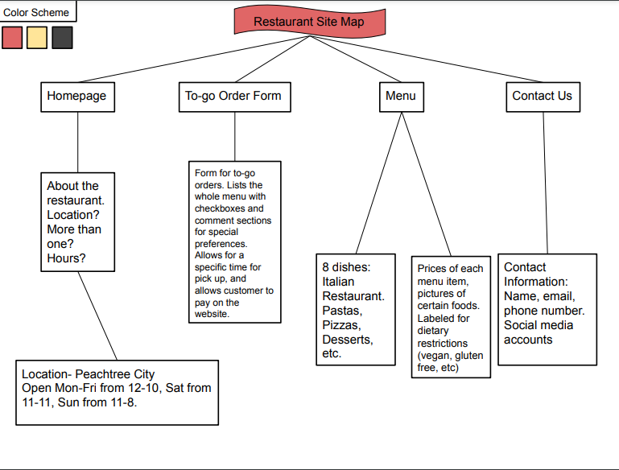

# Restaurant Website Project

**Directions:** You will create a website for your own restaurant. Before you begin creating your website, you research what type of restaurant you would like to create and make a site map. Things to include on your site map: **Home page, menu(with at least 8 dishes), Contact Us, and to-go order form**. You can use google drawings to complete your map. See the example sitemap below the rubric. Your site map **must** be added to your files in repl as it will be a part of the rubric.

Your website must contain at least the 4 pages listed above. Your site must also include the use of a Form (Bootstrap of normal CSS). **Your to-go order form should contain enough information for a customer to successfully place an order for pick up at a specified time.** Other forms of CSS and Bootstrap usage including animations, transitions, glyphicons, page-headers, buttons, containers, tables and hover/active selectors will be needed to create a Professional Level website.

## Rubric

| | 2.5 Point | 7.5 Points | 12.5 Points |
|:-|---------|----------|----------|
|**Content and Quality of Pages**|Website does not meet the minimum required pages.|Website meets the minimum number of pages, but each pages lacks content and overall quality.|Website meets the minimum number of pages, and each page has sufficient and relative content.|
|**Use of To-Go Order Form**|Customer can not effectively place an order using form.|Customer can place an order, but the form needs improvement.|Customer can place an order without issue, and form fits well in the context of the site.|
|**Bootstrap Navbar**|No navbar or broken navbar|Working navbar but does not include extra features|Working navbar that includes features like fixed-top, collapse, or header|
|**Bootstrap Grid-System**|Grid-system not used or provides little to no value|Grid-system is used but does not add much value to looks or responsiveness|Website uses grid-system that improves looks and responsiveness|
|**Use of CSS, Styling and Bootstrap Components**|Little to no effective use of CSS, styling or bootstrap components.|CSS, Styling and Bootstrap compenents are used and partially add to the overall value of the website|CSS, Styling and Bootstrap compenents are used effectively and add value to the overall website.|
|**Professionalism**|Website contains many areas which are unprofessional.|Website contains a few areas which are unprofessional.|Website is completely professional.|
|**Mechanics**|Website has many grammar errors or HTML and CSS code are sloppy.|Website is mostly free of grammatical errors and HTML and CSS are well put together.|Website is free of grammatical errors and HTML and CSS are flawless.|
|**Site Map**|Nonexistent or lacks proper detail to build a professional website|Missing a few details needed to build a proper website|Has all proper details to successfully build a professional level website|

## Example Site Map

